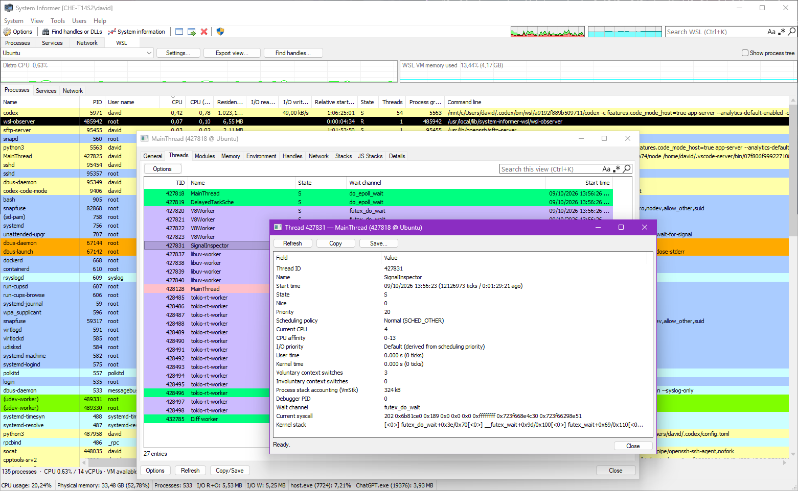

# WSL Tools for System Informer

A native System Informer plugin for inspecting and controlling WSL 2 from a dedicated **WSL** tab. Written in C++ with small C adapters for the System Informer SDK and a self-contained Linux observer.



## What it does

- **Processes:** sortable current and average CPU, resident memory, storage I/O rates, user, state, threads, parent PID and command line; optional Linux scheduling, identity, memory and I/O columns; process tree; CPU history; live filtering.
- **Process inspector:** a structured General page, raw diagnostics, handles, verified ELF modules, all virtual memory mappings, environment variables, thread properties and scheduler controls, native GDB stacks, runtime-aware Node.js/Python/Java stacks and per-process connections. Inspect cgroups, namespaces, capabilities, seccomp, resource limits and status counters.
- **Network:** TCP, UDP and Unix sockets, local/remote endpoints, listening-port filter, socket ownership and a shortcut to the owning process. Search by port, process name, PID or address.
- **Services:** loaded and installed systemd service units, startup state, structured properties, unit configuration and recent journal entries. Start, stop, restart, reload, enable and disable services.
- **Scheduling controls:** per-thread or all-current-thread niceness, CPU affinity, scheduling policy and I/O priority, with optional saved rules for an executable in a specific distro.
- **Process signals:** SIGTERM, SIGINT, SIGKILL, SIGSTOP, SIGCONT, SIGUSR1, SIGUSR2, SIGHUP and SIGWINCH, with process-identity checks using pidfds. PID 1 and the observer itself are protected.
- **Find handles:** search open descriptors, executable paths, working directories and mapped files across the selected distro, then open the owning process or file location.
- **Desktop integration:** native light/dark controls, separate dialog/grid/monospace font roles, System Informer row-highlighting colors and lifecycle highlights, keyboard navigation, filterable inspectors, copy/export, persistent column visibility/widths/order/sorting, and Explorer actions with per-distro path overrides.

The observer runs as **Linux root by default**. Windows administrator privileges are not needed for ordinary monitoring; installation into Program Files may require them. Only the selected, already-running WSL2 distribution is monitored. The plugin does not alter System Informer's main process tree or CPU totals.

## Install

To install or update, close System Informer and run **`WslTools-0.1.0-setup-x64.exe`**. The installer detects the System Informer folder and lets you browse to another location. Its companion checkbox starts checked and applies to all registered WSL 2 distributions, including stopped ones. Stopped distros are temporarily started for companion installation, then stopped again; already-running distros stay running.

The installer registers WSL Tools in Windows **Installed apps** for your Windows user. It keeps its support files and uninstaller under `%LOCALAPPDATA%\Programs\WslTools` and copies the plugin into the selected System Informer folder. Run setup as your normal Windows user: only the isolated Windows file-copy helper requests administrator permission when the target folder needs it. WSL operations remain in the original Windows user's context and run as Linux root. System Informer's executable and saved WSL Tools settings are preserved. When needed, setup offers **Enable third-party plugins in System Informer**, checked by default, and explains that it is required for WSL Tools. Accepting sets `EnablePlugins` to `1` and `EnableDefaultSafePlugins` to `0`, backing up the settings file and preserving all other preferences and explicitly disabled plugins. Uncheck it to leave plugin-loading settings unchanged. This page is skipped when both settings already allow plugins.

To remove an EXE installation, close System Informer and uninstall **WSL Tools** from Windows **Installed apps**. The removal dialog offers a checked companion checkbox for all registered WSL 2 distros; uncheck it to keep the Linux component. Companion removal likewise temporarily starts stopped distros and restores their stopped state afterward. If a step fails, **Retry** repeats that step without restarting setup—for example, after you close System Informer. **Cancel** stops the operation and retains completed changes, support files, and registration so you can retry later or uninstall. If removal fails, the uninstaller aborts and retains its registration and support files for another attempt.

For unattended operation, setup accepts `/SYSTEMINFORMERDIR="C:\path\to\SystemInformer"`. Both setup and its installed `unins000.exe` accept `/COMPANIONS=0` or `/COMPANIONS=1`, plus Inno Setup's standard `/SILENT` or `/VERYSILENT` switches. The uninstaller uses the saved System Informer folder. Companions default to enabled for both installation and removal. Silent installs leave plugin-loading settings unchanged unless you also pass `/ENABLETHIRDPARTYPLUGINS=1`; `/ENABLETHIRDPARTYPLUGINS=0` unchecks the option in interactive setup. A protected System Informer folder or portable settings file may still require a UAC prompt.

**Kernel-driver image protection:** these builds are unsigned. System Informer's kernel driver can reject them even after third-party plugin discovery is enabled, reporting a misleading `0xc000007b` / bad-image error. `KsiDisableImageLoadProtection=1` permits untrusted images, but loading one reduces the host's kernel-driver access level; it is not equivalent to enabling plugin discovery. The installer currently leaves this protection unchanged. A separate System Informer instance started with `-nokph` can use WSL Tools without changing the main instance's driver protection. The DLL includes Control Flow Guard support, which remains enabled.

The **`WslTools-0.1.0-windows-x64.zip`** is the manual alternative and includes `WslTools.dll`, `wsl-observer`, symbols, licenses, documentation, and PowerShell scripts. Extract it and run `install.ps1` with `-SystemInformerDirectory` (Windows plugin files only by default; add `-InstallCompanions` for all WSL 2 distros). Use `uninstall.ps1` with the same folder to remove a manual installation; add `-RemoveCompanions` to remove the Linux component too. In a source checkout these scripts are under `scripts/`. These scripts do not register an entry in Installed apps. Manual file copying into `plugins` is also supported.

For a manual ZIP installation, or if you declined the setup option, enable plugins in System Informer's options and set **Advanced → EnableDefaultSafePlugins** to **0**. These are System Informer settings. The installer detects normal roaming and portable JSON/XML profiles; a custom `-settings` profile must be configured separately. Unsupported or unreadable settings stores are left untouched and setup explains the manual step. Restart System Informer after changing plugin-loading settings.

Open **WSL** and choose a running distribution. If that distro does not have the observer installed, the plugin shows an installation notice in place of the normal view. Choose **Install and retry** to install it as root, verify it, and reconnect.

The companion resides at `/usr/local/lib/system-informer-wsl/wsl-observer`. It is a short-lived helper, not a daemon. On connection, the plugin checks its SHA-256 against the bundled helper and atomically updates an installed copy when it differs. A missing copy requires the install action described above. It does not use a distro package manager. Installation needs `/bin/sh` and standard utilities including `id`, `stat`, `mkdir`, `sha256sum`, `mktemp`, `rm`, `printf`, `head`, `wc`, `chown`, `chmod`, and `mv`; the installer also uses `uname` and `rmdir`. Removal is optional; to remove it manually, disconnect the WSL view and run these commands for each distro (replace `Ubuntu` with the exact distro name):

```powershell
wsl.exe --distribution Ubuntu --user root --exec rm -- /usr/local/lib/system-informer-wsl/wsl-observer
wsl.exe --distribution Ubuntu --user root --exec rmdir -- /usr/local/lib/system-informer-wsl
```

The second command succeeds only if the directory is empty. System Informer settings are preserved, and neither the installer nor plugin replaces the original System Informer executable.

### Compatibility

The Windows plugin and supplied observer target **x64 Windows + x86-64 WSL2**. WSL1 is excluded. The observer requires pidfd-capable Linux for signal controls (normal current WSL2 kernels provide this). Systemd features require systemd to be running inside the selected distro; other views still work without it.

The SDK is pinned to System Informer revision `bfc8145f2744a415319ccaaa8f1e32dd2cf1e596` for reproducible builds. The plugin has been loaded and exercised on **4.0.26255.346**. The small SDK interface used by the bridge was also compared with revision `ac083373839c9a63aeb84bc296ff55c0afb8184b`: its relevant exports, structures and callbacks match. That source comparison is not a runtime test of the newer executable. There is **no exact-version runtime restriction**. Future ABI changes may require rebuilding or adapting `plugin/entry.c` or `plugin/tree_bridge.c`.

## Using the views

_Note: The descriptions below are very detailed. They were AI-generated and should explain every feature in enough detail to understand even subtle details in the behavior and implementation if needed._

The inner views are **Processes · Services · Network**. The top strip holds the distro picker, **Settings**, **Export view**, **Find handles**, and the active view's option (**Show process tree**, **Show inactive services**, or **Listening / bound ports only**). Search uses the normal System Informer toolbar when available; otherwise a local filter appears in the view. The Settings button opens System Informer **Options → WSL**, where you can change CPU display mode, background capture, optional 32-bit detection, the Node Inspector preference, the two interop-plumbing filters, and a distro's Explorer prefix. Select a row and press Enter, double-click it, or use its context menu to inspect or act on it; there is no separate bottom Inspect/Actions row.

Process inspector tabs are **General · Threads · Modules · Memory · Environment · Handles · Network · Stacks**, then a runtime-specific **JS Stacks**, **Python Stacks**, or **Java Stacks** tab when the executable is recognized, followed by **Details**. Service inspectors have **General · Journal · Details**. Grid pages place the integrated search field beside **Options**; match-case, regular-expression and clear controls use System Informer's search behavior. The current filter is applied to the grid, and follows you when changing grid pages. The Options menu above a grid holds page-specific filters and commands; the bottom Options menu acts on the inspected process or service.

WSL monitoring follows System Informer's global **View → Refresh automatically** setting and refresh interval. Use **View → Refresh** or F5 to rediscover running distributions and refresh the selected view, including when automatic updates are off. There is no separate WSL Refresh or Pause button. While the WSL tab is hidden, or System Informer is minimized or hidden, lightweight process samples keep graph history and process identities current. Previously loaded network collections continue tracking socket identities. Services are polled only while the Services subtab is visible in the active WSL tab and System Informer is neither minimized nor hidden; reopening that view refreshes it immediately. Installed unit-file/startup metadata is cached for 30 seconds, with manual refresh, reopening Services, and successful enable/disable actions bypassing the cache. Extra process metadata is requested for visible or sorted columns, enabled highlighting, applicable filters, and process/service tooltip fields when tooltips are enabled and the process view is visible. Command-line tooltip fields also follow the host's command-line-tooltip setting. Returning to the view immediately refreshes that metadata. Turning automatic refresh off also pauses background monitoring. The main view lists only running WSL 2 distributions; the Options and setup dialogs can list stopped WSL 2 registrations too.

**Enable background capture** is on by default. Turn it off to stop all WSL requests and close the observer whenever the WSL tab is inactive, System Informer is minimized or hidden, or another distro is selected. This also pauses requests from inspectors and Find handles for an inactive distro; opening an inspector does not keep its observer running. Returning to that distro in the WSL tab reconnects and refreshes immediately, which can take a second. Graphs leave a gap for the uncaptured time instead of joining the old and new samples. No distro is stopped or shut down.

**Processes:** By default, process CPU follows the Windows convention: **100% = all WSL vCPUs**. In System Informer **Options → WSL**, switch to Linux's convention if preferred: **100% = one fully occupied vCPU**. The registry setting is `CpuPercentOfTotal` (`REG_DWORD`): `1` is the default total-WSL-capacity scale and `0` selects the one-vCPU scale. The summary and CPU graph always divide the selected distro's collected process total by the guest CPU count, regardless of the process-column setting. Memory available/total is VM-wide because WSL distributions share a kernel; RSS is per process and includes shared pages. Read/write rates are Linux storage accounting, not network or every buffered read/write operation.

The optional **CPU (average)** column averages the most recent valid process CPU samples, using System Informer's **Sample count** history length. It is not a lifetime average. It follows the same CPU scale, decimal precision and tiny-value display rules as CPU, and sorts by the unrounded average. History is collected even when the column is hidden, using existing snapshots with no additional WSL queries. Paused capture periods and the first baseline reading after resuming are excluded; retained samples survive a pause. Exited processes, reused PIDs, distro changes and WSL restarts start fresh histories.

All WSL grids use System Informer’s native **TreeNew** control, including inspector results and Find handles. Fixed-column scrolling, scrollbars, selection, header interactions and tooltips therefore use the same control as the Windows views. Type a prefix to jump to a matching primary-column value. Multiple rows can be selected and copied; operations on a resource require exactly one selected, non-removed row.

Right-click a column header for **Size column to fit**, **Size all columns to fit**, **Hide column**, **Reset sort**, or **Choose columns...**. The first visible column stays fixed when scrolling horizontally, separated by a light-grey line. Its header cannot be dragged; use Choose columns to change which column is first. Column names follow Windows terminology where applicable, including **Parent PID**, **Resident set size**, **I/O read rate**, and **I/O write rate**. Additional process columns include UID/EUID/GID/EGID, TTY, niceness, scheduling priority/policy, relative start time, virtual memory, swap, session/process group, last CPU, page faults, executable and working-directory paths, cgroup, tracer PID, cumulative I/O, read/write calls, CPU times, context switches, seccomp and no-new-privileges. Relative start time displays elapsed time as **D:HH:MM:SS**, sorted by its underlying duration. Hidden metadata is not continuously collected unless needed for sorting, an enabled color rule, an applicable filter, or service-unit tooltips; search uses the collected data. **Show process tree** retains the selected process and tries to center it after changing the order.

**Detect 32-bit processes** in **Options → WSL** is off by default. When enabled, the Architecture column or enabled 32-bit-process color can request the executable's ELF class. An inaccessible or non-ELF executable remains unknown. Formatted grid CPU, memory and I/O values use your Windows number locale. CPU follows the host decimal precision (`MaxPrecisionUnit`, normally two); memory and I/O sizes automatically choose 1024-based B, kB, MB, GB and larger units, with two decimals above bytes. Zero CPU and zero-byte I/O rates are blank. Tiny nonzero CPU is also blank unless **View → Processes → Show CPU below 0.01%** is enabled; its cutoff follows the host precision. Numeric sorting always uses the original values, even when a cell is blank or its displayed unit changes.

The process view also follows **Hide processes from other users** (relative to the distro's configured default user), **Hide system processes**, **Scroll to new processes**, and **Sort child processes** / **Sort root processes** when Show process tree is enabled. Hide system processes uses the System processes category: effective UID 0 without a nonzero `SUDO_UID`, whether or not that category's color is enabled. Windows' signed-process filter depends on Windows image-signature semantics and is not applied to Linux processes. The host's Collapse/Expand and column-set commands do not control this separate grid.

Two filters are in **Options → WSL**, both enabled by default. Existing explicitly saved preferences are preserved. **Hide Windows -> WSL interop plumbing processes** hides those `/init` processes that are created as part of launching a Linux binary from Windows (session leader and relay process). **Hide WSL -> Windows interop plumbing processes** hides those processes that are created as part of launching a Windows binary from Linux (the stub process that has the Windows binary's name as process name). These filters only change the displayed process list; they do not change graph totals or snapshot counts.

Hover the main column for a structured process, service, or connection tooltip. Process tips add the effective user, service unit, executable, working directory, terminal, scheduling policy, debugger, and security restrictions without repeating state, parent PID, CPU, or resident-memory columns. For elevated root processes, the tip can show the inherited `SUDO_USER`, UID/GID, and command as **Sudo origin (environment)**; these environment values are an origin hint, not proof of a direct parent process. Fields collected only for tooltips are requested while the Processes view is visible and host tooltips are enabled; other data may also be collected for visible columns, filtering, or highlighting. Command-line text, including the sudo command, also follows System Informer's **Enable command line tooltips** setting. Service tips explain unit state and offer context such as opening its Journal tab; network tips explain endpoints and ownership. All tips use the current collected row and do not run a WSL command when hovered. Header text uses normal window text; header hover uses the native light-blue highlight in light mode.

**Find handles:** enter part of a resource name or path and choose **Search**. The native search box provides regular-expression, match-case and clear buttons. Only resource names are matched; process names, command lines and PIDs never cause every handle of a process to appear. Results include open descriptors, working/root directories, the executable and file-backed mappings. Executable mappings in search results do not imply the file has been verified as ELF; the process inspector's Modules tab performs that check. Double-click or press Enter for **Process properties**; the context menu also offers file-location and copy actions. Searching is explicit, rather than repeated on each keystroke. Literal searches discard nonmatching paths in the observer where safe; regex and Unicode matching use System Informer's matcher. Searches have a five-second scan deadline, a 10,000-candidate limit and an 8 MB response budget. An incomplete-search notice means matching resources can be missing, including when no results are shown. **Cancel** or changing the expression discards a pending reply. An already-running scan finishes its limited request without interrupting other inspectors. No `lsof` installation is required.

CPU and VM-memory graphs stay visible and update across Processes, Services and Network. The memory caption shows used bytes in an automatically selected unit. Hover a sample for its local timestamp, sample interval, and detailed values: CPU of total WSL capacity and one vCPU, process count, highest-CPU process, or memory percent plus exact used/available/total bytes and the largest-RSS process in that sample. The graphs use System Informer host colors and a scrolling time grid.

**Network:** enter a port such as `3000`, or combine terms such as `node 3000`. The ToolStatus search box follows its native matching options. The fallback search ANDs space-separated terms across the collected row values, including data in hidden columns; it does not fetch missing metadata just for a search. **Listening / bound ports only** includes TCP listeners and unconnected UDP endpoints. Unix sockets are included. Double-click an owned socket to switch to Processes and select its owner; press Enter again to inspect it. PID 0 means no owner was visible; it is not a Windows PID. **View → Network → Hide waiting connections** hides ownerless entries and TCP `CLOSE_WAIT` in both main and process-detail network tables. The **Remote hostname** column follows the host's resolve-addresses setting and is resolved only while that column is visible in the main Network view. Hiding it stops lookups even if it remains the sort column. Lookups use the distro's name service, are cached, and leave the numeric endpoint usable when a name is unavailable.

**Services:** inspect a service for structured properties, full diagnostics, its unit file, and a separate **Journal** tab showing the last 100 journal entries. **Show inactive services** is off by default and remembers its value; failed units remain visible. Running services with a PID use the enabled **Service processes** color. The PID column shows the current main process when known; **Go to process** in the context menu selects that process in Processes. Enter and double-click still open the service inspector. Actions have explicit confirmations and run against the system manager as root, not a user's `systemctl --user` manager. Enabling a service and starting it are separate operations.

Bare template units such as `getty@.service` show their unit definition and startup state, with journal entries from matching instances. A template has no runtime PID or expanded instance properties; choose a named instance such as `getty@tty1.service` for those details and for start/stop/restart/reload or enable/disable-at-boot actions.

**Native stacks:** on Threads, select a thread and choose **View native stack…**, or open Stacks and press **Capture all stacks…** (Ctrl+R captures the selected stack page). The initial page explains the capture button, that GDB is required, and that the target pauses while attached. Opening the page does not attach, and capture uses no confirmation dialog. GDB startup scripts, automatic script loading, debuginfod and index-cache writes are disabled. If malformed or missing DWARF causes a symbol-reader failure, a second capture uses minimal symbols, retaining available exported function names, libraries, and module offsets. Both ordinary and fallback captures annotate frames with their mapped module and file offset when that mapping is unchanged across capture, replacing `??` where possible. GDB-provided symbols and source locations are retained; no symbol name is invented. Routine thread/attach announcements are suppressed, and startup warnings follow the stack list under GDB diagnostics. Original diagnostics remain visible. Ptrace restrictions or missing symbols can limit the result.

**Runtime stacks:** the inspector checks the resolved executable name, not the command line. It recognizes Node.js executables named `node` or `nodejs`, CPython names such as `python`, `python2`, `python3`, and versioned/debug/free-threaded `python2.x` or `python3.x` names, plus an executable named `java`. Refreshing process details can add, change, or remove the runtime tab after an `exec()` changes the program. Shell/npm wrappers, PyPy, renamed executables and embedded runtimes are not auto-detected.

For a renamed executable or an embedded runtime, use **Options → Force-show script stacks** at the bottom of the process inspector. This reveals **JS Stacks**, **Python Stacks**, and **Java Stacks** without starting a capture. The choice applies only to that window, survives Refresh, and is disabled after use; closing the window resets it. Capture from the tab for the runtime you want to inspect. Its usual tooling and runtime compatibility requirements still apply. Forced Node Inspector activation requires evidence of Node and an installed SIGUSR1 handler; an existing verified Inspector listener can also be used. Forced Java capture requires a loaded JVM and a matching JDK.

Each stack page opens with instructions about its capture button, pause behavior and required tool. Captures are explicit button/Ctrl+R actions without a confirmation dialog. If automatic Inspector use is disabled, there is a capture-method choice dialog for Node with no verified Inspector listener.

Node.js first looks for a valid Inspector listener owned by the selected process and verifies that the PID returned by its WebSocket endpoint matches the process's innermost `NSpid`. Ordinary application sockets are ignored. It captures the main JavaScript thread and up to 32 reported worker contexts, sequentially, with up to 256 JavaScript frames per context. Each context gets at most one second to reach a JavaScript pause point; idle threads are skipped, and pending pauses are canceled so they do not unexpectedly stop the process later. Native frames and asynchronous promise/task history are not included. Threads are sampled at different times, not as one simultaneous snapshot.

When a capture-owned pause returns only a single `processTimers` frame, the client briefly resumes and retries that same thread at 10 ms intervals, for up to 200 ms within the existing capture deadline. It keeps the first nonempty stack beyond that timer frame, or the latest real timer stack if nothing else is captured. An already-paused debugger thread is never resumed for these retries.

**Use Node Inspector for JS stacks without asking** is enabled by default. On an explicit JS capture, the plugin uses an existing verified Inspector listener or temporarily enables one when needed. If you disable that preference and no Inspector is listening, the dialog offers **Temporarily Enable Inspector**, **Use llnode**, or **Cancel**. The Inspector path uses SIGUSR1 through a pidfd after verifying the selected Node process. It refuses automatic activation when recognizable command-line or `NODE_OPTIONS` settings request a public or unverified bind address. Existing listeners are not reconfigured. Before activation, the plugin records the process's listener identities; it closes only a listener newly created by this capture, and preserves existing pauses. If another client is present when cleanup is checked, the Inspector is left enabled. A connection can still race that check, and Node may disconnect clients when closing the listener, so avoid concurrent debugger sessions. If closure cannot be confirmed, the warning is kept with the stack; the plugin will not attach LLDB while cleanup is uncertain. Node's [Inspector API](https://nodejs.org/api/inspector.html), [Inspector options](https://nodejs.org/api/cli.html#--inspectporthostport), [debugging guide](https://nodejs.org/learn/getting-started/debugging), and [security guidance](https://nodejs.org/learn/getting-started/debugging#security-implications) explain the underlying behavior. Inspector access permits code execution as the Node process user; loopback is still reachable by local programs in the distro.

When the choice dialog is shown and Inspector activation is available, it has **Don't show again**. Checking it and choosing **Temporarily Enable Inspector** saves `UseNodeInspectorWithoutAsking=1` and tries this backend automatically on later captures. The same preference appears in **System Informer Options → WSL** as **Use Node Inspector for JS stacks without asking**. Python 3 is required by the embedded Inspector client; if it is missing, the dialog shows installation guidance (including `apt install python3` for Ubuntu/Debian) and offers only llnode and Cancel, even when the remember preference is enabled. The installation guidance remains in the stack page after Cancel. If an Inspector attempt fails but cleanup is confirmed safe, the plugin tries llnode automatically and keeps the Inspector error beside the fallback. If cleanup is uncertain, it shows the Inspector failure without starting a second debugger. Use **Use llnode** to choose that backend directly.

Each Node process must own its Inspector port. If multiple processes request the default `9229`, a later listener may fail, but the plugin checks ownership and PID instead of attaching to the wrong process. Use `--inspect-port=0` to let Node choose a separate available port. The Inspector client is embedded in `wsl-observer` and runs with system Python 3 using isolated `-I -S` flags; it needs no Python packages or separate script deployment. Without Python 3, the choice dialog explains that Inspector is unavailable and still offers llnode.

Java capture can pause threads at a JVM safepoint. The helper allows up to 15 seconds and 512 KiB of output (Node Inspector uses separate capture and cleanup deadlines). LLDB/llnode captures OS-thread stacks, up to 256 threads and 64 frames per thread. Python uses `py-spy` to collect all Python thread stacks without local variable values. Java uses `jcmd` from the target JVM's matching JDK to run `Thread.print -l` and include locks; traditional thread dumps do not cover every unmounted virtual thread. Ptrace restrictions, disabled JVM attach, runtime/tool version mismatches, or missing debugging metadata can prevent or limit a capture.

Install the tools yourself in the selected distro. For Python, place a trusted, root-owned `py-spy` executable in `/usr/local/bin` or `/usr/bin`; you can build/install it as your normal user and have an administrator copy the binary. See the [py-spy project](https://github.com/benfred/py-spy). For Java, install the JDK matching the target JVM and keep its `jcmd` beside that JVM's `bin/java`; a `jcmd` from another JDK version is not interchangeable. See Oracle's [`jcmd` reference](https://docs.oracle.com/en/java/javase/21/docs/specs/man/jcmd.html).

For the optional Node.js fallback, install LLDB and build `llnode` for that LLDB version. Build it as a normal user (the upstream instructions use `npm install llnode`), then have an administrator copy `llnode.so` to a root-owned system location that is not group/world writable. Checked locations include `/usr/local/lib/llnode/llnode.so`, `/usr/lib/lldb/plugins/llnode.so`, `/usr/local/lib/node_modules/llnode/llnode.so`, and `/usr/lib/node_modules/llnode/llnode.so`. Do not run npm with `sudo`; see the [llnode install instructions](https://github.com/nodejs/llnode#install-instructions). LLDB/llnode compatibility depends on the Node/V8 and LLDB versions. It may not work with every Node version; output can contain partial V8 data or native addresses instead of useful JS frames.

**Inspectors:** General contains individual fields in the ordinary dialog font; Details contains full diagnostics in a fixed-width font. The process General page includes the owning service below Working directory, or **(none)** when no service owns the process; unavailable metadata remains **Not available**. **Start time** in process and thread properties (and the optional Threads column) shows the absolute timestamp in your Windows date/time format and time zone, followed by `(<ticks> ticks / <D:HH:MM:SS> ago)`. The elapsed time reflects the last refresh. Modules lists verified ELF executables and shared objects, grouped by device/inode. Memory lists every mapped virtual-memory area (VMA), including anonymous/JIT mappings and files that are not verified ELF modules. A classification note explains files that could not be verified; those remain in Memory. Sizes in Modules sum mapped segments and exclude gaps. A deleted mapped file is still shown with its deleted marker. Expensive details are requested on demand. A process that exits is reported as unavailable; the inspector never silently follows its reused PID. Environment variables are live sensitive data, so copy/export them deliberately.

On **Threads, Modules, Memory, Environment, and Handles**, **Options** contains that page's hide/show filters, **Highlighting** switches, collection statistics, selected-row actions, and **Save**. A local highlighting switch can suppress a color for that grid; it cannot enable a color disabled globally in System Informer's **Options → Highlighting**. The right-click menu on a row offers the same relevant object actions, alongside copy and save-view commands. Process and service windows place **Refresh** and **Copy/Save** beside **Options** at the bottom, with **Close** at the right and the tab frame aligned with the footer buttons. **Copy/Save** offers **Copy Selection**, **Copy All**, and **Save…**. The process menu includes signals and scheduling controls; the service menu includes service actions. Successful actions refresh the open properties view so it reflects the resulting state.

The Threads grid shows each Linux thread's TID, name, state and wait channel. Optional columns add niceness, scheduling priority and policy, last CPU, user/kernel CPU ticks, and thread start time. Its row menu can show detailed `/proc` and scheduler properties, the kernel stack and current syscall (when the kernel permits those reads), or a native GDB stack. It can also change that thread's niceness, CPU affinity, ordinary scheduling policy, and I/O priority. These Linux scheduler settings are per thread. Scheduling editors use **Save/Cancel**, a niceness spinner, policy/I/O-class dropdowns, and CPU checkboxes loaded from the target. Mixed per-process CPU affinities are shown as indeterminate until resolved; **Select all** and **Clear** work across all CPU pages. **Save** applies the change and closes on success; errors or partial results keep the editor open and appear in a dialog. The process-level scheduling controls in both the process-row context menu and bottom **Options** menu apply a setting to the snapshot of threads currently in the process. They report individual failures and partial completion; the operation is not atomic, and threads created after enumeration follow Linux's normal inheritance rules. A numeric Linux TID can be reused between identity checks and a scheduler syscall, so thread actions cannot be guaranteed atomic against TID reuse.

Thread properties and collection statistics use a single properties grid; statistics notes appear in its status bar. Kernel stacks and ELF symbols/dependencies use a single text view. Memory reads open on **Details**, with mapping metadata on **Properties**. Environment properties append colon-separated values as **Subitem 1**, **Subitem 2**, and so on, including empty entries.

Module actions inspect ELF headers, program/section headers, notes and dynamic metadata with `readelf`; they can show exported or imported symbols and declared dependencies. Dependency inspection reads `DT_NEEDED`, `RPATH`, and `RUNPATH` metadata and does not run `ldd` or execute the mapped image. If `readelf` is missing, install `binutils` in that distro. Memory actions show the selected mapping's `smaps` properties, read up to 1 MiB of a readable mapping and save the captured bytes as a binary file, or search for printable ASCII and UTF-16LE strings in up to 16 MiB. Memory reads do not suspend the process, so bytes can change during capture; unreadable ranges produce partial results. Handle properties combine descriptor flags and position from `fdinfo` with file type, permissions, owner, size, inode, mount ID, and any lock information exposed by the kernel. Environment row actions copy a name, value, `NAME=value`, or shell-quoted assignment; values containing colons also appear as subitems in their properties. These actions are explicit and on demand.

Process scheduling dialogs have **Save for this executable**. After a complete, verified application, the saved rule uses the exact WSL distribution name and full resolved executable path, and stores the selected niceness, affinity, policy, or I/O priority values. The checkbox is selected for an action that already has a saved rule; clearing it and saving removes that action's rule. **Remove saved settings** in either process menu removes all saved scheduling actions for that executable. Saved actions have checkmarks in those menus. While that distribution is monitored, matching snapshots trigger at most one saved action per snapshot. A new process identity, executable path, WSL boot, or thread count starts a new attempt; a persistent failure is reported and is not retried on every refresh. Each application covers the threads present at that moment. Later threads follow Linux inheritance rules; an observed change in thread count triggers another attempt while monitoring continues. Rules are not a pre-launch hook and are not applied while capture is stopped.

**Colors:** WSL tables use enabled colors from **Options → Highlighting**, with the applicable native priority. New and removed rows use the host lifecycle colors and duration ahead of semantic colors. Process priority is debugged (`TracerPid`), fully stopped, partially stopped, background (no controlling TTY), filtered (`wsl-observer`), elevated, 32-bit, system, own, then service. Elevated means effective UID 0 with a nonzero numeric `SUDO_UID`; other root processes use System processes. Own processes match the distro's configured default user's effective UID. Service processes have a `.service` cgroup component, including user services. Root/service processes may therefore use an earlier enabled category's color. The observer uses the enabled Filtered processes color at its normal priority; an earlier enabled rule can still take precedence.

Linux-specific color meanings are approximations where the operating systems differ:

- Thread wait-channel names identify stopped threads, sleeps, futex waits, event/message queues, completion/I/O waits and user-request waits. Unknown wait sites stay unclassified.
- Environment colors compare exact name/value pairs against literal `/etc/environment` values, then the account's `USER`, `LOGNAME`, `HOME` and `SHELL`. Other values use Process environment. These comparisons describe matching baselines, not a proven inheritance history.
- Memory uses Execute pages for executable mappings, System pages for kernel-provided mappings such as `[vdso]` and `[vvar]`, and Private pages for private anonymous/heap/stack mappings. Linux provides no direct Windows CFG-page equivalent, so that color is not guessed.
- Modules use Known DLLs for libraries under standard `/lib*` and `/usr/lib*` paths and Native modules for recognized dynamic loaders there. The main executable is bold. ELF ASLR is not treated as Windows relocated-module detection; ordinary file mappings stay in Memory rather than receiving a guessed module category.
- Inherited handles means `O_CLOEXEC` is absent. Linux normally inherits descriptors across `fork` regardless; this color describes whether they can survive `exec`. Flags show symbolic names plus their hexadecimal value.
- Network uses Unknown process when no owner PID is known. Stopped disabled/masked services use Disabled services; other stopped services can use the host stopped-service text color.

Each rule is used only when its switch is enabled in System Informer's Highlighting options. In particular, Memory and Environment can remain uncolored when their individual page/environment color options are off. Checking suspension for a single-threaded process reuses the process state already collected; only multithreaded processes need the additional task scan.

The first snapshot establishes a baseline without new-row highlights. Search/filter changes do not count as removals. A row is marked removed only after a complete collection, remains copyable during the host highlight period, and is unavailable to actions. A partial or inaccessible collection retains uncertain old rows instead of declaring them removed.

### Keyboard shortcuts

| View | Shortcut | Action |
| --- | --- | --- |
| Main views | Ctrl+K | Standard ToolStatus toolbar search |
| Main views without ToolStatus search | Ctrl+F | Focus local filter |
| Main views | F5 | Rediscover/reconnect and refresh |
| Main process/service row | Enter | Open properties |
| Main Network row | Enter | Select its owner in Processes |
| Inspector resource row | Enter | Open properties; Memory opens Read memory |
| Grids | Type a prefix | Jump to matching primary-column text |
| Grids | Ctrl+A / Ctrl+C | Select all / copy selected rows |
| Process row | Delete | Offer SIGTERM confirmation |
| Inspector | Ctrl+R | Refresh; on a stack page, capture stacks |
| Inspector | Ctrl+F or Ctrl+K | Focus the grid filter |
| Inspector | Ctrl+C / Ctrl+S | Copy / save the current view |
| Inspector | Ctrl+Shift+C | Copy environment value or file/module/mapping path |
| Inspector file/module/memory row | Ctrl+Enter | Open file location |
| Inspector | Ctrl+Tab / Ctrl+Shift+Tab | Next / previous page |
| Scheduling editor | Enter or Ctrl+S | Save the selected settings |
| Scheduling editor | Escape | Cancel/close |
| Inspector/settings/resource viewer | Escape | Close window |

## Explorer path overrides

Use the WSL view's **Settings** button to open **System Informer Options → WSL** for CPU display mode, the Node Inspector preference, and a distro path prefix. You can also configure a registry string value under:

```text
HKEY_CURRENT_USER\Software\David Trapp\System Informer WSL Plugin\PathOverrides
```

The value name is the exact distribution name; its `REG_SZ` value is the Windows prefix for `/`.

For example, to map an Ubuntu distro's Linux paths to drive `R:`:

```powershell
$key = 'HKCU:\Software\David Trapp\System Informer WSL Plugin\PathOverrides'
New-Item -Path $key -Force | Out-Null
New-ItemProperty -Path $key -Name Ubuntu -PropertyType String -Value 'R:\' -Force
```

Thus `/usr/bin/bash` opens as `R:\usr\bin\bash` instead of `\\wsl.localhost\Ubuntu\usr\bin\bash`. Replace `R:\` with a drive prefix available on your system. Without an override the plugin uses `\\wsl.localhost\<distro>\`. Overrides affect Explorer navigation only; all inspection and actions still happen inside the correct distro. Deleted files, sockets, pipes and Linux-only paths that Windows cannot represent are not opened as ordinary files.

Standard WSL Windows-drive mounts are recognized before the distro prefix: `/mnt/c` opens as `C:\`, and `/mnt/c/Users` as `C:\Users`, regardless of the prefix configured for other Linux paths. The mount must be exactly `/mnt/<letter>` or followed by `/`; a path like `/mnt/cfoo` does not match and uses the normal per-distro prefix.

Column visibility, widths, display order and the sort column/direction are saved independently for each table under `Table.*` values in the plugin registry key. Widths are stored in DPI-independent units.

The refresh interval and automatic-update choice come from System Informer's main View settings. Other preferences use the following `REG_DWORD` values in the plugin registry key; explicit saved values override these defaults.

| Setting | Default | Effect |
| --- | --- | --- |
| `EnableBackgroundCapture` | `1` | Keep lightweight capture running while the WSL view is hidden. |
| `CpuPercentOfTotal` | `1` | Display process CPU as a percentage of all WSL vCPUs. |
| `UseNodeInspectorWithoutAsking` | `1` | Try Inspector directly for explicit JS stack captures. |
| `Detect32BitProcesses` | `0` | Read executable ELF class when the corresponding column/color requires it. |
| `HideWindowsToWslInterop` | `1` | Hide the matching Windows-to-WSL plumbing processes described above. |
| `HideWslToWindowsInterop` | `1` | Hide the matching WSL-to-Windows plumbing processes described above. |
| `ShowInactiveServices` | `0` | Show units whose systemd state is `inactive`; failed units remain visible. |
| `ShowProcessTree` | `0` | Remember the process-tree checkbox. |

Saved executable scheduling rules are kept separately in `SavedProcessScheduling` (`REG_SZ` JSON). Use **Save for this executable** and **Remove saved settings** to manage them.

## Build

Requirements: a Linux C++17 compiler with static C/C++ libraries, Windows Visual Studio 2022's **Desktop development with C++**, the Windows SDK, CMake (the VS component is supported), and PowerShell. The standard process/network/service views need no Node.js or Python runtime; the optional Node Inspector backend uses system Python 3 in the distro. The Windows plugin needs no Python, Node.js, or .NET application runtime.

From the Linux checkout:

```sh
./scripts/build-helper.sh
```

From Windows PowerShell, using the Windows-visible checkout path:

```powershell
.\scripts\build-windows.ps1
.\scripts\package.ps1
```

The first Windows build downloads the pinned upstream SDK source and checks its archive SHA-256. It derives public headers and the import library without building System Informer. Later builds can use `-SkipSdk`. Every Windows build still cleans native objects: this prevents stale header layouts across the WSL/Windows staging boundary. Matching PDB symbols are retained for crash diagnosis. Windows compilation is staged under `%LOCALAPPDATA%\WslTools\build`; `-BuildRoot` can select another staging directory.

Packaging requires **Inno Setup 6**: `package.ps1` finds `ISCC.exe` on `PATH` or in the standard Program Files installation folders. Use `-InnoCompiler 'C:\path\to\ISCC.exe'` to select it explicitly. The default produces both `WslTools-0.1.0-windows-x64.zip` and `WslTools-0.1.0-setup-x64.exe`; a missing compiler fails with installation guidance. Use `package.ps1 -SkipInstaller` to deliberately build only the ZIP. `scripts/build-installer.ps1 -PackageDirectory <prepared-payload> -OutputDirectory <output-folder>` can compile an installer from an already prepared package directory on local NTFS. Packaging and installer compilation stage under `%LOCALAPPDATA%\WslTools` before copying their final files to `dist/`, including when the checkout is on SSHFS.

`dist/` contains the DLL, observer, ZIP package and setup EXE; generated files and `.deps/` are ignored by Git. `scripts/build-helper.sh` refuses to silently publish a dynamically linked observer. The optional `CXX` environment variable selects another existing Linux compiler. The current Windows build target is x64, even though the helper source can also compile on ARM64.

## Architecture and limits

See [architecture](docs/architecture.md) and the [wire protocol](docs/protocol.md).

- This is sampling, not an audit trail. Very short-lived processes and sockets can disappear between snapshots.
- Socket tables cover the observer's current network namespace. Processes in this distro's PID namespace are considered for ownership; other distributions or private container network namespaces can leave sockets unowned or invisible. The UI reports incomplete ownership rather than inventing a PID.
- There is no per-process network-byte accounting, GPU accounting, interactive debugger, memory writes, remote shell, or custom Windows driver. GDB is used only for explicitly requested stack captures.
- RSS/PSS and VM memory use different accounting. Guest CPU is not subtracted from `vmmemWSL`.
- Collector startup uses WSL's public command interface and a running-state check. A distribution stopping between the check and launch can still race with startup. An open collector can affect WSL idle shutdown. Pausing/disconnecting releases it; the plugin never issues `wsl --shutdown` or terminates a distro.
- Large collections have explicit limits, timeouts and truncation notices. Inspection errors preserve the last snapshot and label it stale; transport failures require reconnection.
- Service actions can legitimately restart or stop components you depend on. SIGUSR1/2 are program-defined and terminate a process if it has no handler. The plugin names the exact action before asking for confirmation. The unsaved-work warning appears for SIGTERM, SIGINT and SIGKILL; other signals retain their own action description.

## Licensing

Original project code: [MIT, David Trapp / Trapp Innovations](LICENSE). The vendored JSON library is nlohmann/json 3.11.3 under its [MIT license](vendor/json.LICENSE.MIT). System Informer's SDK is fetched separately and retains its upstream license. See [third-party notices](THIRD_PARTY_NOTICES.md).
